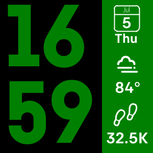
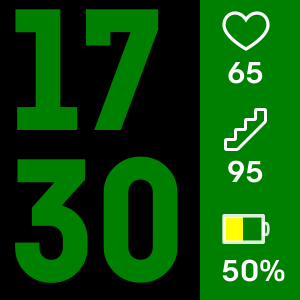
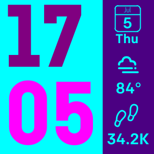
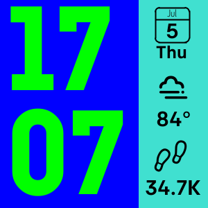

# StyleTime

A simplistic Fitbit watchface.

The sidebar will display the date, weather, and steps. When the watch is tapped, the sidebar switches to show heart rate, floors, and battery level.






## Developing

[Fitbit's command line interface](https://dev.fitbit.com/build/guides/command-line-interface/) is used for developing.

To get into the fitbit shell, first run:

```sh
npm install
npx fitbit-build
```

(you should only need to do this once)

Then:

```sh
npm run fitbit
```

This will drop you into Fitbit's CLI.

### Building the project

While in Fitbit's CLI, run:

```sh
fitbit$ build
```

This might prompt you to create the defualt build script, say _Yes_.

Outside the CLI, run:

```sh
npm run build
```

This will add an `app.fba` file to the `build` directory (ignored by Git via the `.gitignore` file)

This `fba` file is what is used to install the app on the watch and to publish the app on Fitbit's Gallery.

### Installing the watchface

For ease of development, the [Fitbit OS Simulator](https://dev.fitbit.com/release-notes/fitbit-os-simulator/) can be used.

While in Fitbit's CLI, run:

```sh
fitbit$ build
fitbit$ install
```

This will open a browser that will have you login to Fitbit; make sure you login to the same account here as on you simulator/phone because the CLI will use the account to install the app.

### Lint

#### ESLint

To lint the entire project, run:

```sh
npm run lint
```

If there are no lint errors, nothing will be printed out.

Lint rules are based off of [Airbnb's eslint rules](https://github.com/airbnb/javascript) with some modifications to meet the project's requirements.

#### Prettier

[Prettier](https://prettier.io/) is used on all files in the project.

To manually run prettier on the entire project, run:

```sh
npm run prettier
```

_NOTE:_ This will overwrite files with changes.

### More Resources

Check out https://dev.fitbit.com/getting-started/ for a quick start guide

For more info on Fitbit's libraries, check out https://dev.fitbit.com/

### Project layout

#### `app` folder

The `app` folder contains the code that is loaded onto the watch.

Each "widget" in the sidebar is separated out into its own file to keep the logic separated.

`app/index.js` initializes the application and sets up an `ontick` event that gets fired every minute.

#### `companion` folder

The `companion` folder contains all code that gets run on the phone that the watch is connected to.

The companion handles calling out to the internet for i.e. fetching weather, and handles restoring settings from the phone when the watchface starts up.

#### `common` folder

The `common` folder contains code that is shared by both the `app` and `companion` folders.

#### `resources` folder

The `resources` folder contains all SVGs that define the application's layout in the `resources/gui` folder, along with all the icons that are used in the `resources/icons` folder.

In `resources/gui` there is a folder for each "widget" on the watchface; there is more or less a 1:1 correlation between these and the JS files in the `app` folder. Each "widget" has an SVG and a CSS file associated with it.

`resources/widgets.gui` is a special file that handles importing all of the GUI elements that are defined in `resources/gui`

### Secrets

There is also no support or best practices for secrets since there aren't any environment variables or anything. As such, there is a file `common/secrets.js` that has all the secrets needed by the application. This file is not checked into source control.

At a minimum, this file should contain:

```js
// common/secrets.js
export const getOpenWeatherMapApiKey = () => 'YOUR_OPENWEATHERMAP_KEY';
```

### Message Passing

In order for the watch app and the phone companion to communicate, they send messages to each other.

`app/messaging.js` and `companion/messaging.js` set up messaging between the app and the companion.

Message types are defined in `common/commands.js` and messages can be passed between the two using the `sendToPeerSocket` function in `common/util.js`.

#### Settings

Since settings are stored on the phone, they have to be sent to the watch when the watch face initializes. Because of this if i.e. colors have been changed, they will first show up as their defaults until the watch requests the settings from the phone.

See `app/settings.js` for where the watch will receive the settings and what it will change. The only _required_ setting that the user has to fill out is the weather zip code; fetching the weather will not start until this setting is filled in.

`companion/settings.js` will listen for settings changes coming from the phone and send them along to the watch with the message passing mechanism. This is so that as the user changes settings on the phone they immediately show up on the watch.

`settings/index.jsx` defines all of the available settings that are displayed on the phone.

## Icons

Weather Icons are from [dripicons-weather](https://github.com/amitjakhu/dripicons-weather) from Github user [amitjakhu](https://github.com/amitjakhu) (Thank you!)

All other icons are from [Fitbit's sdk-design-assets](https://github.com/Fitbit/sdk-design-assets) repo with the exception of the battery icon which I made myself.

### Adding Icons

All icons should be saved as 48x48 pixel PNGs

In order for icons to be rendered with the color from the settings (and not just the color of the PNG) they have to be saved in "Grayscale mode". This can be done in Photohop by opening the PNG and choosing `Image -> Mode -> Grayscale`. The result should have a black background for transparency and a white background for fill.

## Weather

Current weather status comes from the [OpenWeatherMap](https://openweathermap.org/) API
